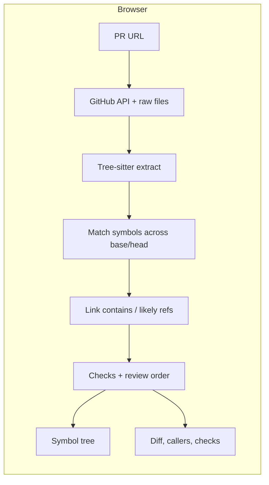

# Change graph

A pull request is a tree of **symbols**, not a wall of file hunks. Reviewers see classes, methods, and functions — added, modified, moved, or removed — instead of scrolling a patch.

- **Repo:** https://github.com/nikitaroz/change-graph
- **Live app:** https://nikitaroz.github.io/change-graph/
- **Demo video:** attach the Loom walkthrough with the submission (2–5 min). Replay the same loop with the steps below.

## Short write-up

Code review still starts from a file diff: hundreds of red and green lines, little sense of *what* changed. A refactor like [uv#21827](https://github.com/astral-sh/uv/pull/21827) is four files and +561 −647. GitHub shows a wall. The story is that `Plan` went away, `Target` grew the state, and tests moved into `PublishTest`. That story is in the symbols, not the hunks.

Change graph is for people who review Python pull requests — maintainers, staff engineers, and anyone doing a first pass on an unfamiliar change. Paste a public GitHub PR URL. The app fetches both sides of each changed file, parses them with Tree-sitter, matches symbols across the diff, and draws a file tree of classes and functions. Click a node for its diff, likely callers and callees, and checks such as a removed type with no remaining references.

Impact is speed and orientation. Review order walks definitions before users (`j` / `k`). A rename shows up as a rename, not a delete plus an add. The demo is the same PR on GitHub versus in this app: find `Plan`, see who still points at `Target`, and walk the refactor without hunting through the patch. The pipeline is name-based and Python-first; it is a lens on the review, not a replacement for reading the code that matters.

## Quick start

```bash
git clone https://github.com/nikitaroz/change-graph.git
cd change-graph
npm install
npm run dev
```

Open http://localhost:5173/, paste a public GitHub pull request URL, press Enter.

Optional token (raises the GitHub API limit from 60 to 5,000 requests/hour):

```bash
cp .env.example .env.local
# set VITE_GITHUB_TOKEN, then restart npm run dev
```

Or paste a [classic personal access token](https://github.com/settings/tokens/new?description=change-graph) in the app when it asks. No scopes are required for public repos. Do not put a token in a production build or commit `.env.local`.

```bash
npm run build    # production bundle (GitHub Pages uses /change-graph/)
npm run preview  # serve the production build locally
```

## How to reproduce the demo

No dataset download and no required API key. The app reads **live public GitHub pull requests**.

1. Open the deployed app: https://nikitaroz.github.io/change-graph/  
   or run locally with `npm install && npm run dev`.
2. If GitHub returns a rate-limit error, paste a classic PAT (no scopes) or set `VITE_GITHUB_TOKEN` in `.env.local` as in `.env.example`.
3. Load [astral-sh/uv#21827](https://github.com/astral-sh/uv/pull/21827) — four files, +561 −647. Deep links:
   - Live: https://nikitaroz.github.io/change-graph/?pr=https://github.com/astral-sh/uv/pull/21827
   - Local: http://localhost:5173/?pr=https://github.com/astral-sh/uv/pull/21827
4. On GitHub that PR is a wall of red and green. In Change graph the tree should show `Plan` removed, `Target` modified (renamed from `TargetConfiguration`), and `PublishTest` / `TargetSession` added.
5. Click `Target` for new fields (`publish_args`, `environment`, `secrets`) and likely callers. Open `Plan` and confirm the check **Plan: 0 references remain**.
6. `j` / `k` walks review order (definitions before users). `[` / `]` is back/forward.

Optional second PR (workflow pin; YAML is parsed but not drawn): https://github.com/astral-sh/uv/pull/12705  
A smaller Python test change: https://github.com/boto/boto3/pull/4844

A spoken beat sheet lives in [`docs/demo-script.md`](docs/demo-script.md).

## Tech stack

| Layer | Choice |
|---|---|
| UI | React 19, Vite 7, TypeScript |
| Tree + diff | custom tree view, `diff` |
| Parse | `web-tree-sitter` + `tree-sitter-wasm` (Python, YAML) |
| Data | GitHub REST API + `raw.githubusercontent.com` in the browser |
| Hosting | GitHub Pages (`nikitaroz.github.io/change-graph`) |

## Architecture



`src/github.ts` loads the pull request. `src/pipeline/` parses both sides, matches names and bodies, links references, and runs checks. `src/App.tsx` and `src/components/TreeView.tsx` render the result. There is no backend.

## Data and provenance

There is **no bundled dataset and no synthetic data**. Every run fetches the chosen public pull request at request time:

| Source | What | Provenance |
|---|---|---|
| `GET /repos/{owner}/{repo}/pulls/{n}` | Title, body, SHAs | [GitHub Pulls API](https://docs.github.com/en/rest/pulls/pulls) |
| `GET /repos/{owner}/{repo}/pulls/{n}/files` | Changed paths | Same, paginated |
| `raw.githubusercontent.com/{owner}/{repo}/{sha}/{path}` | File text at base and head | Public Git history of that repo |

Demo PRs are third-party open source (uv, boto3) used only as examples. Nothing is scraped into this repository.

## Known limitations

- **Python symbols only** in the tree. YAML jobs/steps are parsed but not drawn.
- Reference edges are **name-based** (same file, then same simple name) and labeled likely. Not a type checker.
- Unauthenticated GitHub access is **60 requests/hour per IP**; a token is optional.
- Public repositories only unless you supply a token that can read the repo.
- Tokens in `localStorage` or `VITE_*` are visible in the browser. Do not ship a token in the Pages build.
- The GitHub files API is capped at 3,000 files per pull request.
- Leftover matching can pair similar leftover symbols across a large refactor (for example a renamed helper that also moved class).

## Next steps

- Languages beyond Python, and drawing YAML / CI nodes in the tree.
- Stronger resolution (imports, attributes) so reference edges are less “likely.”
- Optional GitHub App or server-side token so Pages visitors are not sharing anonymous rate limits.
- Tests for match/link/checks on the demo PRs.
- Private-repo support without putting a PAT in the frontend.

## Team roster

| Name | Role | Contact |
|---|---|---|
| Nikita Rozanov | Design and engineering | [nikitaroz@gmail.com](mailto:nikitaroz@gmail.com) · [@nikitaroz](https://github.com/nikitaroz) |

Solo submission.

## The view

The main view is a symbol tree, grouped by file, in source order.

- Rows read like the code: `class Target:` and `def publish(…)`.
- Added, modified, moved, and removed symbols use their own color and mark.
- Click a symbol to inspect it. Folders and files expand from the chevron so a class click does not collapse its methods.
- The right pane shows the per-symbol diff, callers, callees, and checks.

Keyboard: `j`/`k` review order. Arrow keys move in the tree. `[`/`]` back/forward.
